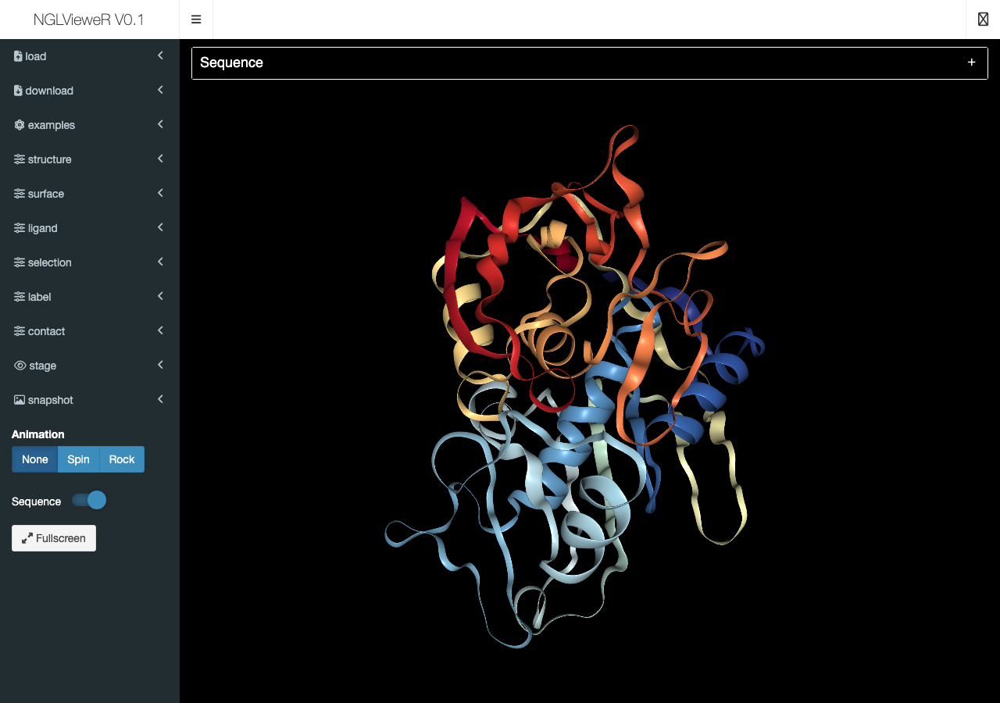

# shinyliveNGLVieweR

A browser-based protein structure viewer. Load a PDB file, customize the
representation, save annotated sessions — all in your browser, no install
required.

> **Live demo:** https://nvelden.github.io/shinyliveNGLVieweR/



## What it does

- **Load any PDB file** from your computer or pick one of the bundled examples
  (6xcn, 2pne, 7ahl, 6fp7, 6qzy, 7cid).
- **Choose how the structure is drawn** — cartoon, ball+stick, ribbon, surface,
  spacefill, licorice, hyperball, rocket, and more — with full control over
  colour scheme and opacity.
- **Highlight ligands, water, and ions** as separate, independently styled
  representations.
- **Pin custom selections** by residue range or chain, each with its own
  representation, colour, and label.
- **Add residue or atom labels** with configurable text, colour, size, offset,
  and background.
- **Show molecular contacts** — hydrogen bonds, π-stacking, salt bridges,
  hydrophobic contacts, and more — between any two selections.
- **Tune the scene** with background colour, camera type (perspective /
  orthographic / stereo), light intensity, and near/far clipping planes.
- **Snapshot** the current view to a transparent PNG.
- **Save and reopen entire sessions** as `.ngl` files — every selection, label,
  contact, and viewer setting is restored.

## Using the viewer

The sidebar groups controls by what they affect:

| Panel | What it does |
| ----- | ------------ |
| **load** | Upload a local PDB / mmCIF / NGL file. |
| **download** | Save the current session (with all selections, labels, and contacts) as a `.ngl` file. |
| **examples** | One-click load of the bundled structures. |
| **structure** | Pick the main representation (cartoon, ball+stick, surface, …) and colour scheme for the protein backbone. |
| **surface** | Add or hide a molecular surface; control colour scheme, colour, and opacity. |
| **ligand** | Choose how ligands are drawn (ball+stick, spacefill, hidden); toggle water and ions. |
| **selection** | Highlight specific residues or atoms with their own representation. Save named selections you can re-edit later. |
| **label** | Place residue or atom labels. The floating "Label options" popout exposes text colour, size, fixed-vs-scaling, offsets, and background. |
| **contact** | Show interactions (hydrogen bond, hydrophobic, π-stacking, halogen bond, ionic, metal coordination, water-mediated, cation-π, …) between two selections. |
| **stage** | Background colour (dark / light theme), camera, light intensity, clipping. |
| **snapshot** | Export the current view as a PNG. |

Below the sidebar, **Animation** drives the viewer (Spin / Rock / Fullscreen) and **Sequence** toggles a clickable residue strip above the structure — clicking a residue highlights it in the 3D view.

### Selection syntax

Selection text fields (in **structure**, **surface**, **selection**, **label**, **contact**) accept NGL's selection language. A small "?" icon next to each field opens a modal with the cheat sheet, but the most common shortcuts are:

- `20-30` — residues 20 through 30
- `:A` — chain A
- `20-30 and :A` — residues 20–30 on chain A
- `<NG>` — residues within range of an `NG` ligand (the modal explains the exact form)
- `not protein` — everything except the protein

Leave the field empty to apply to the whole structure.

### Saving and reopening sessions

The **download** panel writes a `.ngl` text file containing the original PDB plus every annotation you've added. To pick up where you left off, drop that `.ngl` file back into the **load** panel and the entire scene — structure, surface, ligand, stage, selections, labels, contacts — comes back as you left it.

## Tips

- The viewer renders at full window height. On phones, rotate to landscape for more vertical room.
- Set **stage → background** to *white* to switch the whole UI to a light theme.
- Pinch-zoom and two-finger drag work on touch devices for the 3D canvas.

## Run it locally

If you'd rather run a local copy (offline, faster cold start, no GitHub Pages):

```bash
git clone https://github.com/nvelden/shinyliveNGLVieweR.git
cd shinyliveNGLVieweR/docs
python3 -m http.server 8080
# open http://127.0.0.1:8080
```

That serves the prebuilt static site directly — no R install needed.

## Credits

Built on:

- [NGLVieweR](https://github.com/nvelden/NGLVieweR) — Shiny htmlwidget wrapper around NGL.js
- [NGL.js](http://nglviewer.org/ngl/api/) — the WebGL rendering library
- [Shinylive](https://github.com/posit-dev/r-shinylive) — Posit's WebAssembly Shiny runtime

## License

[MIT](LICENSE)
